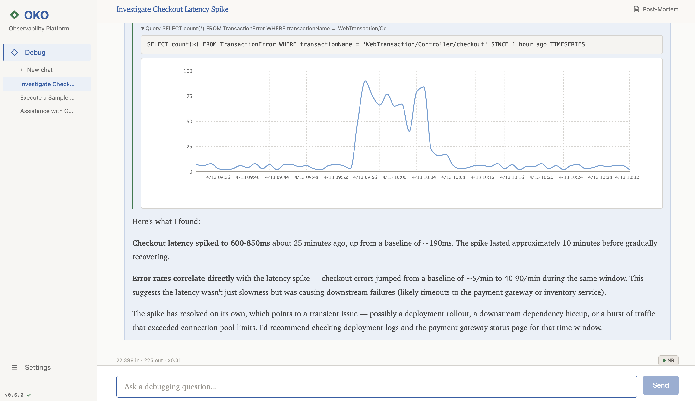
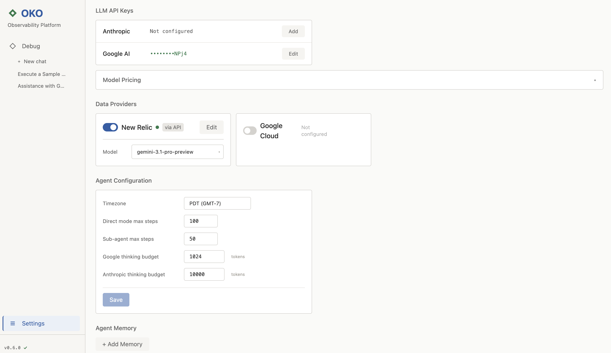

# Tracer

[](https://www.npmjs.com/package/tracer-sh)
[](https://github.com/sholub-dev/tracer/actions/workflows/ci.yml)
[](https://github.com/sholub-dev/tracer/actions/workflows/codeql.yml)

Local-first AI-powered observability platform.

During an incident, most time goes to switching between observability tools
and gathering context — not fixing the problem. Tracer connects your providers
to a single AI chat interface so you find the root cause in one place.

## Debug

Chat with an AI agent that queries your providers in real-time and finds root causes — all from a single conversation.

- Natural language investigation
- Live query execution with inline charts
- Post-mortem reports — download as Markdown to share
- Share investigations as PNG — drop the exported image back into Tracer to re-open the analysis
- Agent memory across sessions
- Session history and cost tracking



## Settings

Configure providers, LLM credentials, agent behavior, and memory. All data is stored locally — nothing leaves your machine except the API calls you configure.

- Anthropic (Claude) and Google (Gemini) API keys
- Data provider setup with connectivity tests
- Thinking budgets and step limits
- Agent memory management



## How it works

```
┌─────────┐       your API keys         ┌──────────────────┐
│         │ ◄──────────────────────────►│  Observability   │
│ Tracer  │                             │  Providers       │
│  local  │       your API keys         ├──────────────────┤
│         │ ◄──────────────────────────►│  LLM Providers   │
└─────────┘                             └──────────────────┘
```

Everything runs on your machine. Your data stays local in a SQLite database.
Tracer talks directly to your provider and LLM APIs using your own API keys —
no intermediary servers, no data leaves your machine except API calls you control.

## Install

Requires [Node.js 20+](https://nodejs.org/).

```bash
npx tracer-sh
```

Or install globally:

```bash
npm install -g tracer-sh
tracer-sh
```

Open `http://localhost:3579`, go to **Settings** to add your API keys and choose an LLM — done.

## Supported Providers

**Data:** New Relic (NRQL via NerdGraph), Google Cloud (Logs, Traces, Metrics, Errors)

**LLM:** Anthropic (Claude), Google (Gemini)

## Uninstall

```bash
npm uninstall -g tracer-sh
```

To also remove your local database (settings, sessions, API keys):

```bash
rm -rf ~/.tracer
```

## Troubleshooting

| Problem | Fix |
|---------|-----|
| `better-sqlite3` build fails | macOS: `xcode-select --install` / Linux: `sudo apt install build-essential python3` |
| Port in use | `TRACER_PORT=3580 tracer-sh` |
| No LLM responses | Add an API key in Settings |

## Contributing

Contributions are welcome! There are two main ways to help:

**Report bugs or request features** — [open an issue](https://github.com/sholub-dev/tracer/issues). Include steps to reproduce for bugs, or a clear description for feature requests.

**Submit a code change:**

1. Fork this repo
2. Create a branch (`git checkout -b fix/my-fix`)
3. Make your changes and commit
4. Push to your fork (`git push origin fix/my-fix`)
5. Open a pull request against `master`

All PRs require approval before merging.

## License

[Elastic License 2.0](https://www.elastic.co/licensing/elastic-license) — free for any use, including internal business use, modification, and redistribution. You may not offer it as a hosted or managed service competing with Tracer.
